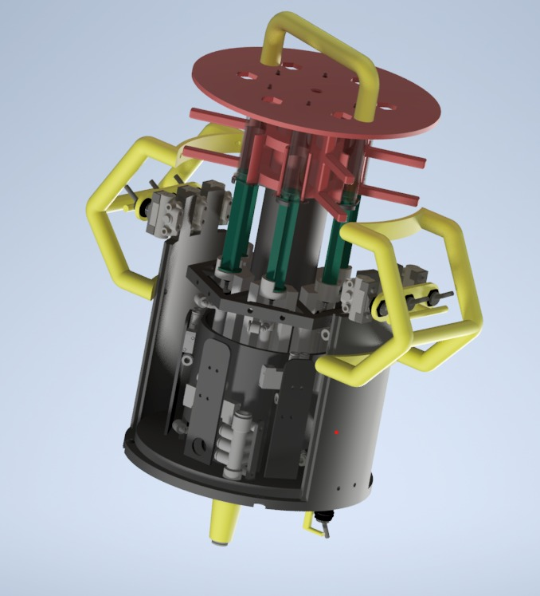

In unserer Forschung dreht sich alles um den sogenannten Meeresschnee. Aber was genau ist das? Meeresschnee besteht aus Überresten und Ausscheidungen pflanzlicher und tierischer mariner Organismen, die sich zu Aggregaten von einigen Zentimetern Durchmesser verbinden. Das kontinuierliche Absinken dieser Flocken erinnert an Schneefall an Land.

Mit unserem „Marine Snow Mobile“ haben wir ein innovatives Konzept entwickelt, um diese Stoffe gezielt zu beproben. Momentan haben wir erst einen 3D gedruckten Prototypen welcher ein Apnoetaucher nutzen kann, später kann man unseren Mechanismus durch einen Raspberry Pi steuern und auf einen Tauchroboter montieren. Derzeit nutzen Meeresbiologen Kräne mit Flaschen für die Probenentnahme, was jedoch sehr unpraktisch ist. Unser Prototyp, der mittels Pneumatik Spritzen ansteuert, soll diesen Prozess effizienter gestalten.

Dies erfolgte in Kooperation mit dem Department für funktionelle und evolutionäre Ökologie der Universität Wien und war nur durch zahlreiche Materialspenden von der international tätigen Firma "SMC" möglich.

Unser Prototyp sieht derzeit so aus:

